  

 

# `01` ABOUT ME

<table>
<tr>
<td>

I'm **Nandhini**, a B.Tech Artificial Intelligence & Data Science student at **Chennai Institute of Technology** passionate about building intelligent software that bridges **AI research** and **real-world products**.

My interests span **Generative AI**, **Agentic AI**, **Full Stack Development**, and **FinTech**, with a focus on designing scalable systems that are practical, reliable, and user-centric.

Currently exploring autonomous AI workflows, multimodal applications, developer tools, and open-source technologies while actively participating in hackathons and engineering production-ready solutions.

</td>
</tr>
</table>

 

---

# `02` TECH STACK
# `02` TECH STACK

  

# `03` GITHUB STATS

---

*"Building intelligent systems that solve real-world problems."*

